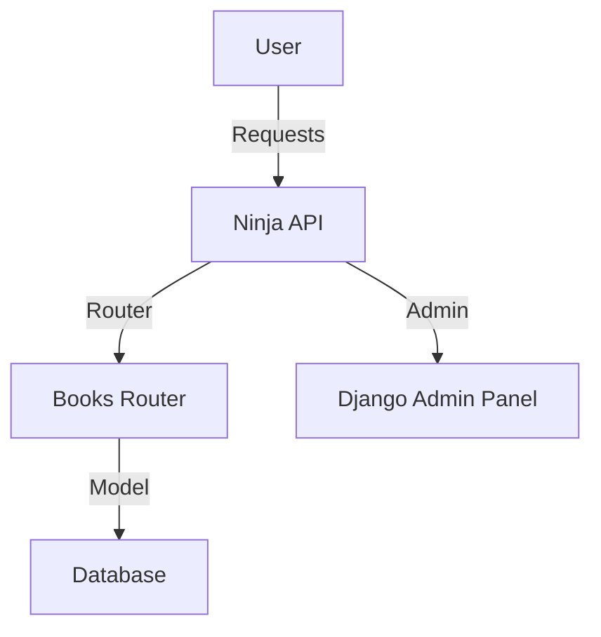

# 📚 API-Book-Reg-Aval

A robust and scalable API built with Django and Ninja for managing book registrations, categorization, and ratings.

---

## 📖 Overview

`API-Book-Reg-Aval` offers a comprehensive solution for managing books, their categories, and user-generated ratings. It allows seamless creation, retrieval, updating, and random querying of books with optional filtering by grade and category. With its RESTful design, this project is optimized for both developers and end-users.

---

## 🎯 Features

- **CRUD Operations** for books and categories.
- **Dynamic Rating System**: Add or update ratings and comments for books.
- **Random Book Selection** with optional filters.
- **Admin Panel** for backend management.
- **Fully Typed Schemas** with Ninja and Pydantic for robust API validation.

---

## 🛠️ Architecture



---

## 🚀 Installation & Usage

### Prerequisites

- Python 3.10+
- Django 5.1+
- Virtual environment tool (e.g., `venv` or `conda`)

### Setup

1. **Clone the Repository**
   ```bash
   git clone https://github.com/Caio-Felice-Cunha/API-Book-Reg-Aval.git
   cd API-Book-Reg-Aval
   ```

2. **Create and Activate a Virtual Environment**
   ```bash
   python -m venv venv
   source venv/bin/activate  # On Windows: venv\Scripts\activate
   ```

3. **Install Dependencies**
   ```bash
   pip install -r requirements.txt
   ```

4. **Apply Migrations**
   ```bash
   python manage.py migrate
   ```

5. **Run the Server**
   ```bash
   python manage.py runserver
   ```

6. **Access the Application**
   - **Admin Panel**: [http://127.0.0.1:8000/admin](http://127.0.0.1:8000/admin)
   - **API Root**: [http://127.0.0.1:8000/api/books](http://127.0.0.1:8000/api/books)

---

## 🧑‍💻 Development Setup

### Setting Up the Development Environment

1. Follow the installation steps above.

2. Install additional development tools:
   ```bash
   pip install django-debug-toolbar
   ```

3. Enable Debug Toolbar by adding it to `INSTALLED_APPS` in `core/settings.py`:
   ```python
   INSTALLED_APPS += ['debug_toolbar']
   ```

4. Configure URLs for development:
   ```python
   from django.urls import include
   urlpatterns += [path('__debug__/', include('debug_toolbar.urls'))]
   ```

### Running Tests

- Run all tests:
  ```bash
  python manage.py test
  ```

### Submitting Contributions

1. **Fork the Repository** on GitHub.
2. **Create a New Branch** for your feature:
   ```bash
   git checkout -b feature-name
   ```
3. Commit your changes and push them to your branch.
4. Submit a Pull Request with a detailed description of your changes.

---

## 🐞 Known Issues & Future Plans

### Known Issues

- The `RandomFiltersSchema` currently supports only minimal filtering.
- No built-in support for pagination in `list_books`.

### Future Plans

- Implement advanced filtering with logical operators.
- Add comprehensive pagination and sorting options.
- Enhance front-end integration for seamless user experience.

---

## 📄 License

This project is licensed under the [MIT License](LICENSE).

---

## 🙏 Acknowledgments

Special thanks to all contributors and users who have provided valuable feedback to make this project better.

## ⚖️ Credits

This project was developed as part of the "4 Days 4 Projects" initiative by [Pythonando](https://pythonando.com.br) on YouTube.